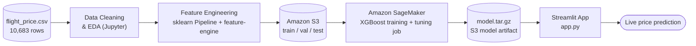

# ✈️ Flight Price Prediction — AWS SageMaker

An end-to-end machine learning pipeline that predicts Indian domestic flight ticket prices, built to mirror a real production ML workflow: raw data → EDA → feature engineering → training on **AWS SageMaker** → deployment as an interactive **Streamlit** app.

<p align="center">
  
</p>

<p align="center">
  
  
  
  
  
</p>

---

## Overview

Flight prices swing on airline, route, time of day, season and number of stops — and those relationships are messy and non-linear. This project builds a full ML system around that problem using a real-world dataset of **10,683 Indian domestic flights**:

1. **Explore** the data to understand what actually drives price.
2. **Engineer features** with reusable, production-style `scikit-learn` / `feature-engine` pipelines.
3. **Train and tune** an XGBoost regressor on **Amazon SageMaker**, with data staged through **S3** and a hyperparameter tuning job searching for the best configuration.
4. **Serve** the trained model behind a simple **Streamlit** web app so anyone can get a live price prediction.

It's an "applied learning" project, not a Kaggle leaderboard entry — the emphasis is on building something that behaves like a real enterprise pipeline end-to-end, cloud infrastructure and all.

## Architecture



## Exploratory Data Analysis

A few of the patterns the EDA notebook (`notebooks/eda.ipynb`) surfaces, which directly informed the feature engineering:

<table>
<tr>
<td width="50%">

**Price varies a lot by airline**
Jet Airways and Multiple Carriers command a premium over budget carriers like TruJet and SpiceJet — a strong candidate feature.


</td>
<td width="50%">

**Duration and stops are highly correlated with price**
Spearman correlation shows `total_stops` (ρ = 0.72) and `duration` (ρ = 0.70) are the strongest numeric drivers of price.


</td>
</tr>
<tr>
<td width="50%">

**Average price moves seasonally by source city**
Prices out of Banglore and Delhi spike in March, then settle — useful signal for date-based features.


</td>
<td width="50%">

**Most tickets carry no extra info flags**
~78% of fares have no additional info, so this field was collapsed into a rare-label + binary "has info" signal rather than a large sparse category.


</td>
</tr>
</table>

## Feature Engineering

`app.py` rebuilds the exact preprocessing pipeline developed in `notebooks/feature-engineering.ipynb`, combining `scikit-learn` and `feature-engine` into one `ColumnTransformer`:

| Feature | Technique |
|---|---|
| `airline` | Rare-label grouping → one-hot encoding |
| `date_of_journey` | Extracted month / day-of-week / weekend flags, min-max scaled |
| `source` / `destination` | Mean target encoding + power transform, plus a hand-crafted "is northern city" flag |
| `dep_time` / `arrival_time` | Cyclical hour/minute scaling **and** a categorical "part of day" (morning/afternoon/evening/night) bucket |
| `duration` | Winsorized outliers, then an RBF-kernel similarity transform against the 25th/50th/75th percentiles, a short/medium/long bucket, and an "over 1000 min" flag |
| `total_stops` | Direct-flight binary flag |
| `additional_info` | Rare-label grouping + "has additional info" binary flag |

A `SelectBySingleFeaturePerformance` step then prunes any engineered feature that doesn't clear an R² threshold on its own, keeping the final feature set lean.

## AWS SageMaker Pipeline

The trained pipeline runs entirely on AWS infrastructure rather than a local notebook:

<p align="center">
  
</p>

- Preprocessed train / validation / test splits are pushed to an **S3** bucket.
- A SageMaker **XGBoost training job** (with a Bayesian hyperparameter tuner searching `eta`, `alpha` and `max_depth`, minimizing `validation:rmse`) trains the model on managed compute.
- The resulting `model.tar.gz` artifact and preprocessing objects land back in S3:

<p align="center">
  
</p>

- `preprocessor.joblib` and `xgboost_model.json` are pulled down locally and loaded straight into the Streamlit app for inference.

## Results

| Split | R² |
|---|---|
| Train | 0.187 |
| Validation | 0.148 |
| Test | 0.185 |

Honest numbers from a lightweight, 10-round baseline XGBoost model tuned in a short SageMaker tuning job — the model captures real signal but there's clear headroom (see [Next Steps](#next-steps)). The point of this project was proving out the *pipeline*, from raw CSV to a cloud-trained model behind a live app, rather than squeezing out leaderboard-level accuracy.


## Getting Started

This project uses [`uv`](https://docs.astral.sh/uv/) for dependency management (a `pyproject.toml` / `uv.lock` are included).

```bash
# Clone the repo
git clone https://github.com/A-C-Sai/flight-price-prediction-using-aws-sagemaker.git
cd flight-price-prediction-using-aws-sagemaker

# Install dependencies
uv sync
# (or: pip install -r requirements.txt equivalent via `uv export`)

# Run the app locally — the preprocessor is re-fit against data/train.csv on startup
uv run streamlit run app.py
```

Then open the local URL Streamlit prints, fill in an airline, route, date and time, and hit **Predict**.


## Next Steps

- Increase `num_round` and widen the hyperparameter search space beyond the current lightweight tuning job.
- Engineer route-level features (e.g. historical average price per source–destination pair).
- Add SHAP-based explainability to the Streamlit app so predictions come with a "why."
- Containerize the app and deploy it via AWS (ECS/App Runner) alongside the SageMaker endpoint, instead of running the model locally.